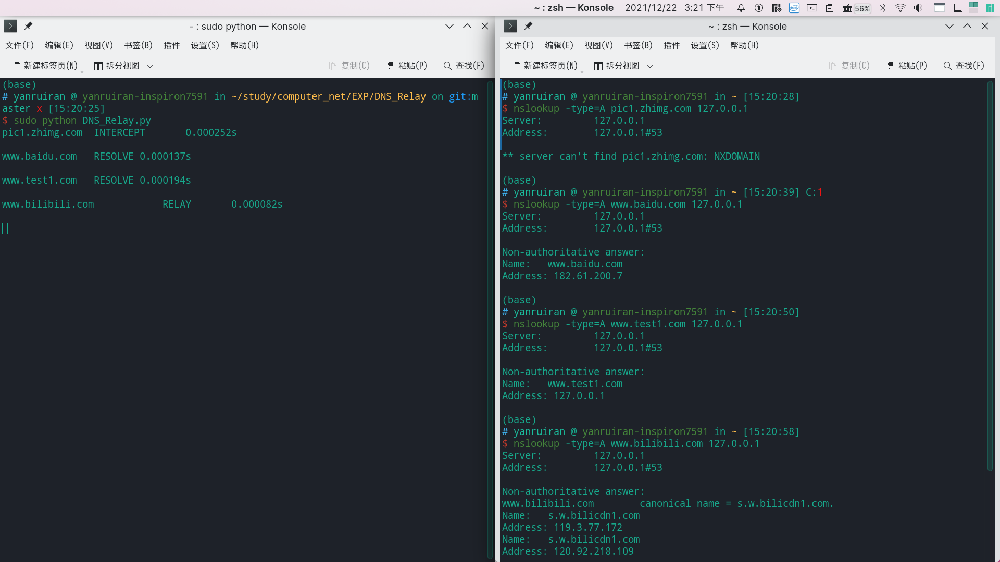
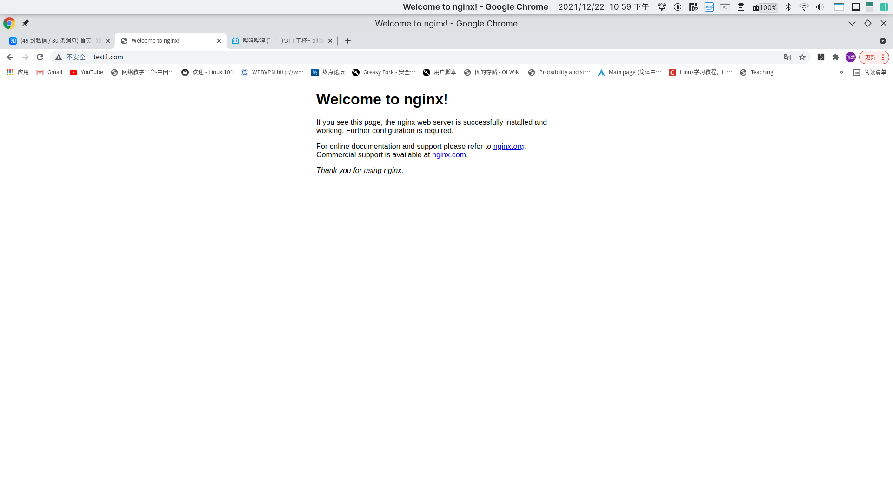

 

# DNS Relay实验

## 实验要求

根据配置文件DNS Relay Server 决定如何响应请求。响应策略如下：

* Relay：当请求的域名不在配置文件中时，将请求转发给一个正常的DNS Server ，然后将收到的response回复客户端
* Intercept：当请求的域名在配置文件中有对应的非0.0.0.0 ip地址，将该ip地址返回给客户端
* Local resolve：当请求的域名在配置文件中对应ip地址为0.0.0.0 ，将DNS response 报文中Rcode置为3表示域名
  不存在，然后将地址返回给客户端

配置文件样例如下：

```
0.0.0.0 picb.zhiming.com
202.38.64.10 www.baidu.com
182.61.200.7 www.test.com
```

OUTPUT：

* DNS查询的域名
* 怎样处理查询请求的(intercept/local/resolve)
* 处理时间

客户端使用nslookup和web browser进行测试，查看处理是否成功。

## 程序说明

### 类、函数、重要变量解释

类与函数及重要变量用声明及注释的方式进行解释。

DNS_Packege类：

```python
class DNS_Packege:  
    # 一个DNS Frame实例，用于解析和生成DNS帧
    
    def __init__(self, data): 
        # 构造函数，通过传入的比特流转为十进制数对DNS报文中各段进行赋值
        pass
    
    def get_query(self, data):
        # 得到报文段中query部分的各个参数
        pass
    
    def generate_response(self, ip, Intercepted):
        # 根据请求报文生成响应报文
        pass
    
    def get_response(self, ip):
        # 根据请求报文生成响应报文中的answer段，generate_response会对该函数进行调用
        pass
```

DNS_Relay_Server类：

```python
class DNS_Relay_Server:  
    # 一个relay server实例，通过缓存文件和外部地址来初始化
    
    def __init__(self, cache_file, name_server):
        # 根据cache_file生成映射字典
        # 变量：
        self.trans = {} # 将id映射到对应发送方地址、查询域名、开始的处理时间进行记录
        self.name_server = name_server # 转发要用的可靠服务器，通过参数传入
        pass
    
    def load_file(self):
        # 读取config文件
        pass
    
    def run(self):
        # 使用轮询策略监听本地接收到的报文，每收到一个DNS报文就开一个线程进行处理
        pass
    
    def handle(self, server_socket, data, addr):
        # 处理接收到的dns报文
        pass
```

### 程序具体细节

根据`DNS_Relay_Server`生成实例`relay_server`，通过`relay_server.run()`对DNS报文进行监听，当收到DNS报文时进行处理。处理前先记录开始处理时间方便计算处理时长，根据报文生成一个`DNS_Pakege`实例`RecvDp`。

如果收到的时一个DNS请求报文(对应`RecvDp.QR == 0`)，查看该请求的域名是否在配置文件中。如果不在，记录发送方地址、查询域名、开始处理的时间存入到字典trans中，直接对该报文进行转发，转发到可靠DNS服务器并打印域名、处理方式为RELAY以及处理时间；当域名在配置文件中，根据要求判断处理方式是INTERCEPT还是RESOLVE，只需查看配置文件中域名对应ip是否为0.0.0.0，若为0.0.0.0则意味着是INTERCEPT，否则为RESOLVE，生成对应响应报文，将其发送给源地址。

生成响应报文的方法如下：

* **INTERCEPT：**根据RFC文档，将首部FLAG中的AA位改为1，RCODE改为3，表示被查询的域名不存在；ANCOUNT部分设置为与QDCOUNT相同，表示响应数量。Answer部分中，name = b'\xC0\x0C'(压缩算法，通过指针指向报文中域名的起始位0c位)，type = 1(type=A)，class = 1(class=IN)，ttl = 200，rdlength = 4(对应后面ipv4地址是4位长)，rdata为对应重定向地址(INTERCEPT中重定向到0.0.0.0)。将上述Answer部分加入到前面修改后的报文后，即可生成响应报文。
* **RESOLVE： **与INTERCEPT唯一有区别的是首部字段，由于能重定向到一个正确的地址，直接使用标准的响应报文中的首部即可，与INTERCEPT不同处是FLAG段，`flag = 0x8180`(INTERCEPT中`flag = 0x8583`)；ANCOUNT部分设置为与QDCOUNT相同，表示响应数量。Answer部分与INTERCEPT处理方式一样，只是重定向的地址不再是0.0.0.0。将Answer部分加入到前面修改后的报文后，即可生成响应报文。

当收到一个DNS响应报文，代表这是之前进行relay转发后的可靠dns服务器发回的响应，由于之前记录了发送方地址(源地址)，将其发送回源地址即可。发送后删除记录。

还有一个细节是如何处理QNAME段得到域名。采用的算法是用一个指针i指向标识字符长度的数的地址，根据字符长度读取字符，读取完后i跳到下一个label重复进行，直到读到标识字符长度的数为0，也就是QNAME的结束部分，每次读一个label后判断是否结束，如果没有结束，在两个label中加上`.`即可。

## 测试

### 测试要求

分别用nslookup和浏览器访问 www.zhihu.com, www.baidu.com, www.test1.com 以及example.txt中不存在的随机外部网站，如www.bilibili.com。查看结果。

注意到我们将www.test1.com被重定向到了IP地址127.0.0.1，为了正确完成此部分的测试，需要在本地部署一个简单的Web服务器。

example.txt文件内容如下

```
0.0.0.0 pic1.zhimg.com
0.0.0.0 pic2.zhimg.com
0.0.0.0 pic3.zhimg.com
0.0.0.0 pic4.zhimg.com
0.0.0.0 static.zhimg.com
0.0.0.0 picb.zhiming.com
182.61.200.7 www.baidu.com
127.0.0.1 www.test1.com 
```


### 测试环境及配置

测试在linux系统下进行，需要进行如下配置：

* 安装nginx，在命令行中输入`nginx`开启nginx，在浏览器中访问127.0.0.1能看到nginx欢迎页面即可。
* 修改默认dns服务器，linux默认dns配置文件为/etc/resolv.conf，修改里面的nameserver为127.0.0.1即可。注意，每次连接网络都要修改，因为系统每次联网后都会配置相关设置重新配置默认DNS服务器。
* 清空浏览器缓存。

### 测试结果

nslookup测试：

分别测试了example.txt中的几个域名，以及一个不在example.txt的域名www.bilibili.com，都有返回了正确的结果。结果如下



浏览器测试：

结果如下：


可以看到知乎的广告已经全部被屏蔽了，表示intercept成功。



www.test1.com也返回了nginx欢迎页面，表示resolve成功。


www.bilibili也能正常访问，表示relay成功。

但实验中发现，对于www.baidu.com这种知名网站(本实验还测试了youtube等网站，都会出现这种情况)，会采取一些安全措施，我们无法直接将其重定向到其他的ip，只能重定向到属于百度的ip，例如example.txt中182.61.200.7本来就是百度的一个ip，是可以通过www.baidu.com重定向的。但这样的重定向也没什么意义，因为这相当于自己重定向到自己。

通过ping测试和nslookip测试可以发现resolve是成功的，但浏览器不能访问，原因可能是浏览器中设置了这些知名域名的检查机制，如果返回的不是该域名的绑定ip就会报错，就无法重定向了。这样做也确实让用户访问更加安全，防止用户受到不法分子利用重定向造成的侵害。
