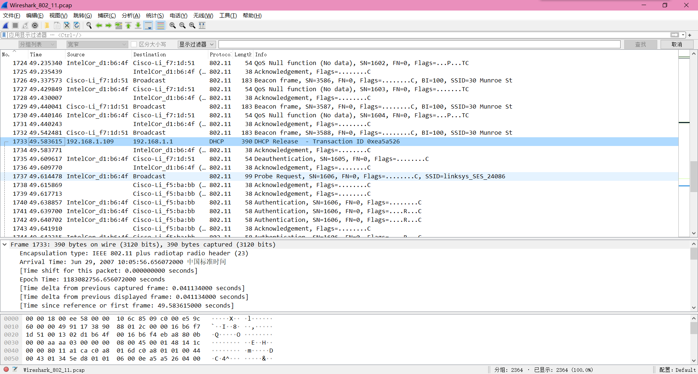
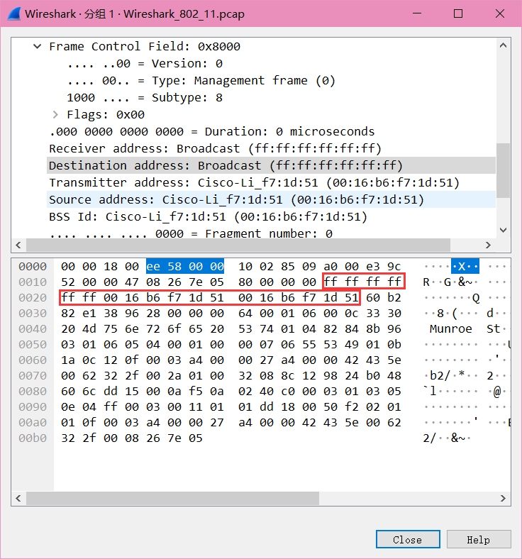
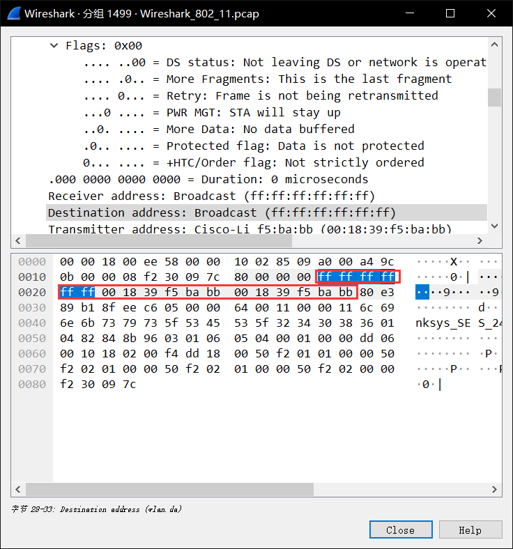
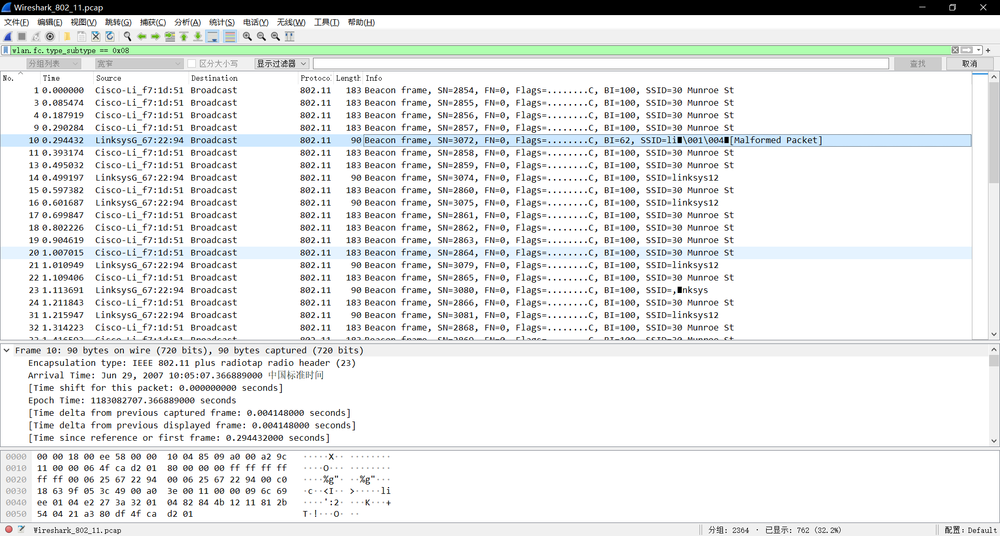
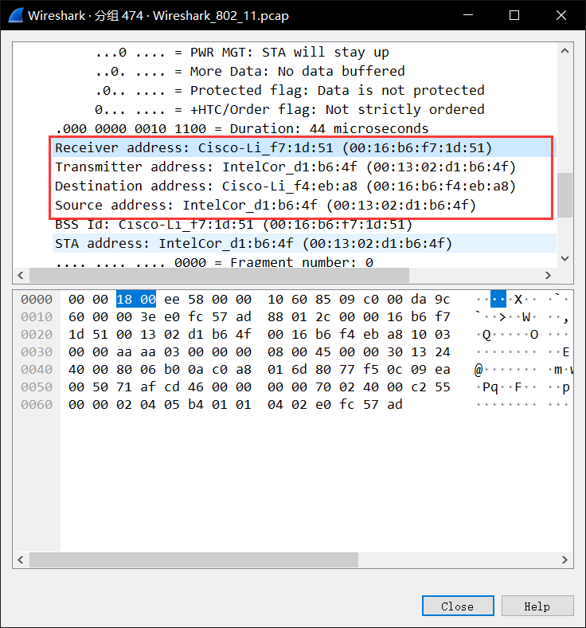
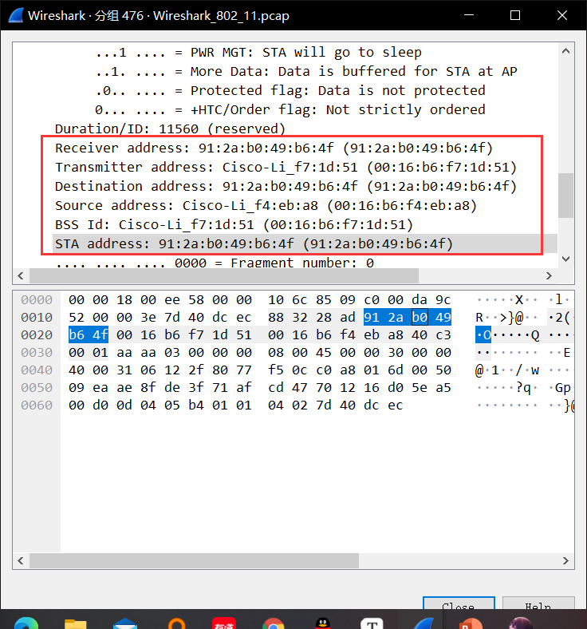

# Trace Analysis 实验

**PB19000196 晏瑞然**

## 实验要求

Submit to bb.ustc.edu.cn

1.A pdf file named “id + name + Trace_analysis.pdf”

2.For Q1 – Q5, you need to give the answer and give a screenshot of the information of the beacon frame in Wireshark.

3.For Q6 – Q8, you need to give your answer and a brief explanation.

4.Deadline: 2022/01/25

## Q&A

### 1. What are the SSIDs of the two APs that are issuing most of the beacon frames in this trace? 

Linksys_SES_24086 and 30 Munroe St.

### 2. What are the three addresses in the Beacon frame from the two APs respectively. 

**30 Munroe St:**

addr1(destination address): ff:ff:ff:ff:ff:ff

addr2(source address): 00:16:b6:f7:1d:51

addr3(BSS ID): 00:16:b6:f7:1d:51 

**Linksys_SES_24086:**

addr1(destination address): ff:ff:ff:ff:ff:ff

addr2(source address): 00:18:39:f5:ba:bb

addr3(BSS ID): 00:18:39:f5:ba:bb

### 3. How many APs the wireless laptop has received Beacon frames from? List their MAC addresses. Why the laptop can receive frames from an AP even though it does not associate with the AP? 

使用wlan.fc.type_subtype == 0x08找到所有的beacon frames，检查里面的source，有如下MAC adress.共5个。

00:16:b6:f7:1d:51

00:06:25:67:22:94

00:18:39:f5:ba:bb

66:02:25:67:22:94(t=44.633946)

00:ac:20:67:22:94(t=56.102695)

笔记本收到的其他AP的帧都是beacon帧，因为那些beacon帧是广播的(即destination address是ff:ff:ff:ff:ff:ff)，AP通过周期性的发送beacon帧来声明某个802.11网络的存在。

### 4. Find the 802.11 frame containing the SYN TCP segment for this first TCP session (that downloads alice.txt). What are the three MAC addresses in the frame, which is the address for wireless laptop / AP / first-hop router? 

该帧在 t = 24.811093

3个MAC addresses 分别是 destination addres，source address，BSS ID. 

wireless laptop(source address)： 00:13:02:d1:b6:4f

AP(BSS)：00:16:b6:f7:1d:51

first-hop router(destination addres)：00:16:b6:f4:eb:a8

### 5. For the SYN-ACK segment of the first TCP session, what are the three MAC addresses in the frame, and which is the address for wireless laptop / AP / first-hop router? 

该帧在t = 24.827751

分析与上相同

1st hop router(source): 00:16:b6:f4:eb:a8

wireless laptop(destination): 91:2a:b0:49:b6:4f

AP(BSS):  00:16:b6:f7:1d:51

### 6. For the above mentioned SYN-ACK segment, is the sender MAC address corresponds to the web server’s IP address? Why? 

不对应，TCP SYN-ACK上sender MAC address应该是AP的MAC address不是web server的。

### 7. What two actions are taken (i.e., frames are sent) by the host in the trace just after *t=49*, to end the association with the *30 Munroe St* AP? 

1. t = 49.583615时发送了一个DHCP包给DHCP服务器(ip: 192.168.1.1)
2. t = 49.609617时发送了一个DEAUTHENTICATION frame (Frametype = 00 [Management], subframe type = 12[Deauthentication])

### 8. Can you capture a similar trace? Why or why not? 

不行。在默认情况下，电脑上的wifi adapter会自己将无线帧转换为有线帧（ethernet frame）,如果要得到802.11帧的话，还要另设置一个虚拟网卡，来侦听wifi包。

