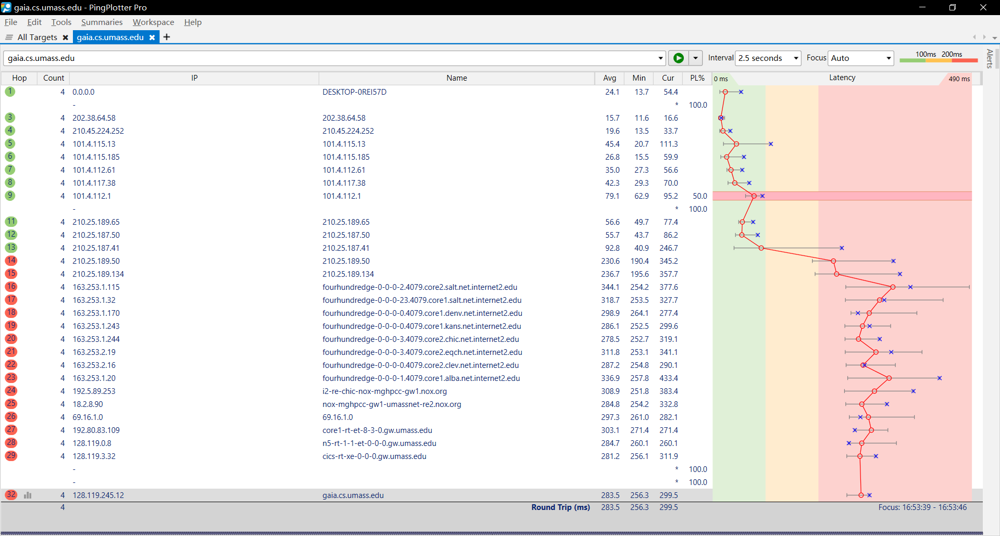
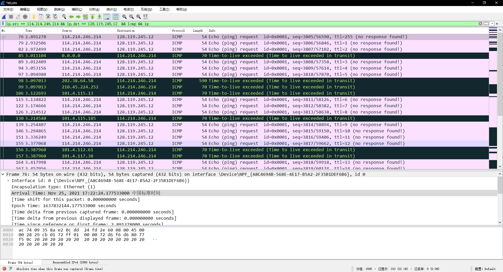
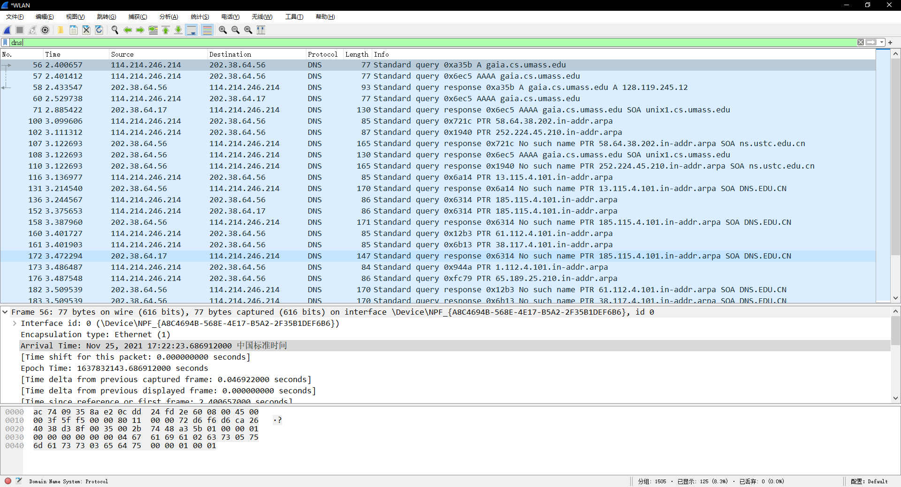
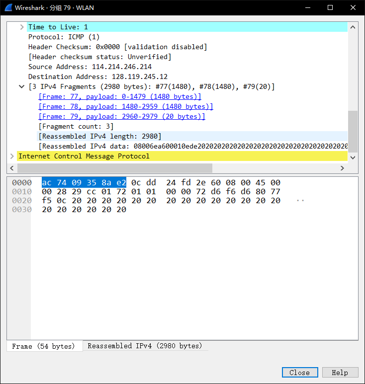
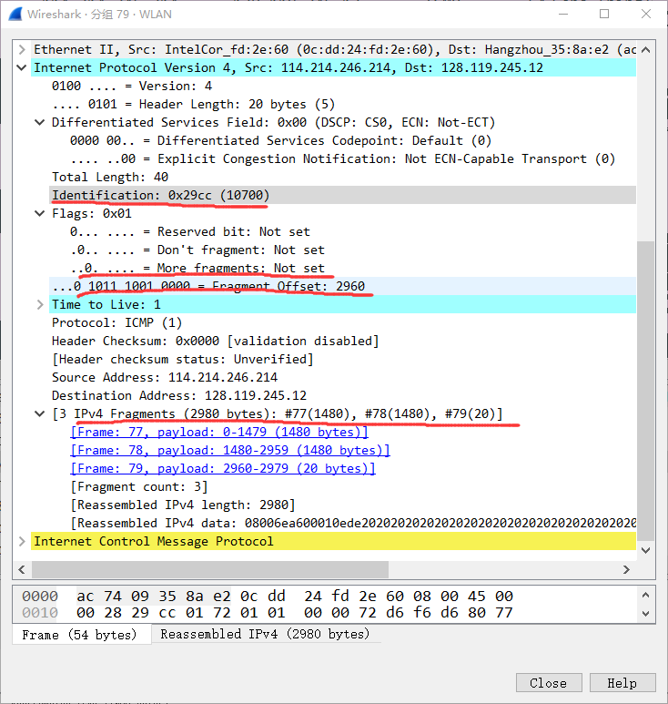

# traceroute实验

## 实验要求

Submit to bb.ustc.edu.cn

* A pdf file named “id + name + traceroute.pdf”
* The packet trace you have captured.
* Your answers to the questions
* For Q1, you need to give the screenshot of the result after performing filter rules and packet with the application-layer protocol.
* For Q2- Q6, you need to give the corresponding screenshot and explanation.
* deadline: 2021/11/30

## traceroute:

## Q&A:

### 1. Display the rules to filter the IP and ICMP packets between source host and destination host. Are there any other Application-layer protocols when you traceroute gaia.cs.umass.edu?

rules: 

ip.src == 114.214.246.214 && ip.dst == 128.119.245.12  && icmp && ip

screenshot:

other application layer protocols:

DNS protocol.

screenshot:

### 2. How many hops between source and destination? Find the first ICMP Echo Request packet that has TTL=1, is this packet fragmented? If yes, how many fragments, and why is the packet fragmented? 

hops: 30

is this packet fragmented? yes

fragment count: 3（见下图）

why is the packet fragmented? 

因为这个IP数据报长度超过了MTU，所以会进行分片。可以看到上图中数据报大小为2980B，被分为3个片，分别为1480B、1480B、20B。

### 3. How the packets are fragmented and reassembled? For each fragment, how to know if it is the last fragment, and how many bytes are contained in each fragment? Print the packets and answer by highlighting the relevant fields.

当数据报长度大于MTU时，路由器会将数据分为两个或更多个较小的IP数据报，用单独 的链路层帧封装这些较小的IP数据报。重组时在目的主机端系统之中，通过IP数据报的标识、标志、片偏移字段重组。发送主机通常将发送的每个数据报的标识号加1，目的主机就能通过标识号知道它属于哪个大的数据报。最后一片的标志比特设为0其他设为1，用来让目的主机确信已经收到了最后一片。通过片偏移字段指定该片在初始数据报的哪个位置。前两个一个片中有1480bytes，最后一个片有20bytes。如图所示。下图中More fragment（多分片）字段即为标志比特，当路由器对报分进行分片时，除了最后一个分片的MF位设置为0外，其他所有分片的MF位均设置1，以便接收者直到收到MF位为0的分片为止。

### 4. What packet is returned from the router when TTL expires? What is contained in the payload of the packet?

当TTL到期时数据报会被丢弃。在有效载荷中包含要交付给目的地的运输层报文段（TCP或UDP），也可能承载其他类型的数据，如ICMP报文。

### 5. Which link crosses the Pacific, give the router addresses at the two ends of the link. Explained your reason. 

two ends: 210.25.187.41 and 210.25.187.50

如图所示：

访问210.25.187.41只需92.8ms而到210.25.187.50则需要230.6ms远大于前面的时延，所以肯定是跨海了。

### 6. How long is the trans-Pacific link? (given that a bit transmits 2*10^8 m/s in fiber). 

由5可知，两次的RTT分别为92.8ms与230.6ms：
$$
length = \frac{RTT_2-RTT_1}{2} *v = \frac{230.6ms-92.8ms}{2}*2*10^8m/s=1.378*10^7m
$$
